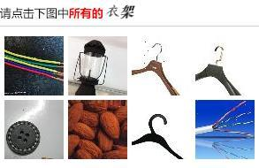
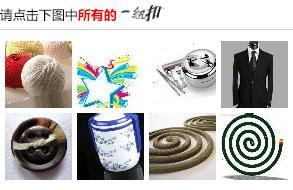
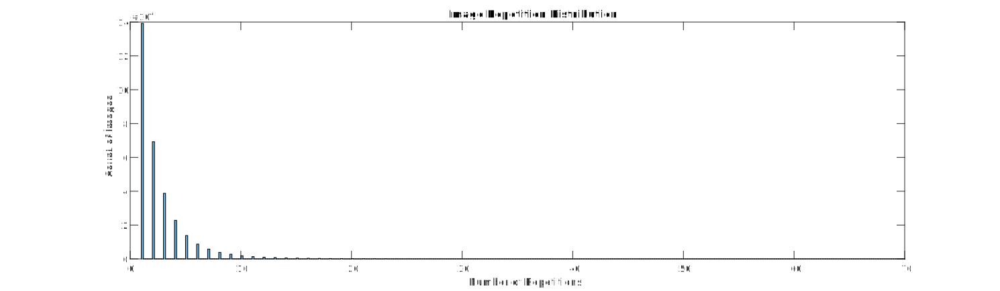

12306 CAPTCHA Recognition
==============

Heqing Ya, Haonan Sun

Mentors:
Tai Sing Lee, Christos Faloutsos

Background
----------
12306.cn is the ticketing website for China National Railway. 

Since there are 1.2 billion people in China, and railway is the best traveling choice for most people due to low price and convenience. Thus, the tickets become kind of scarce resources especially during national vacations, such as Spring Festival: billions of people go home across the country to meet their family.

Scalpers could use low latency network and image recognition methods to get the tickets as soon as they were released, and resell for a profit.

To avoid this, 12306 has established a special kind of CAPTCHA to prevent automatic queries from scalpers.

Problem
--------------

The goal is to use unsupervised methods to break the CAPTCHA by picking out the images of the target category.

__Image Description__

Two CAPTCHAs are shown below:

 

It consists of two parts:

- Category Label
    
    The Chinese characters after the three highlighted-in-red character "所有的".
    
- Images

    Eight small images in 2 x 4 cells.

Each time it randomly shows 8 images, and ask users to click all the images of a certain category, like "road", "car", "potato", etc.  

__Input__

CAPTCHA image.

__Output__

The positions of all target images.

__Constraint__

Running time: 1s

Accuracy: Over 50%

Preliminary Study
---------

I have downloaded about 100, 000 CAPTCHAs from the website, which contains 800, 000 sub-images.

- __Total Number of Image__

    Since the images are randomly picked, the total number can be estimated by the distribution of numbers of repetitions on each image.
    
    Assume the probabilities for each image getting picked follows uniform distribution, then the number of images' repetitions follows normal distribution, if sample size is larger than the total number of image (Lindeberg Levy Central Limit Theorem).

    According to the test result on 800, 000 sub images, most of the images only appeared once. Therefore, the total number of image could be more than 1, 000, 000, or even more.

    
- __Image Correlation__

    According to observation, images of the same category are more likely to be picked into one CAPTCHA, even if they are not in the target category in the CAPTCHA. For example, in the first image, the target category is "hanger", and image 1 and 8 both belong to "wire". In the second image, the target is "button", and image 7 and 8 belong to "mosquito coil".
    
    These are not incidents, since there are about 600 categories, the probability P(6 images are all from different categories)=2.5% (similar to Birthday Paradox Problem), but the real statistic is significantly higher than this. This may be related to the random strategy of the website. It is a useful prior for clustering.
    
    According to this character, we can do clustering on the image sets by building an undirected graph model: the images are vertices, and the if two images show in one image, there's an edge between them, and the weight is the number of times that two images show together. 
    
    Each time when two images appear together, add one to the weight of the edge between them.

Importance
-------------
CAPTCHA is critical for online systems to avoid brute force attack. Breaking this kind of CAPTCHAs not only provide ideas on how to produce more reliable CAPTCHAs, but also offer some new thoughts on application of computer vision, machine learning, data mining on large dataset. In addition, this is also a good programming practice for cloud computing.

Algorithm Flow
--------------
__Model Construction__

1. Estimate the total number of images
2. Collect enough CAPTCHAs to construct image-image and image-label graphical models 
3. Construct graph model with cooccurrence information and features of the images.
3. Cluster images and labels according to the graph.

__CAPTCHA Recognition__

1. Match the new CAPTCHA with clustered and labeled images and labels in the database.

Plan
-------------
1. Gathering Data (End of April)
    
    Download 20 million CAPTACHAs to form the dataset. Collect basic statistics of the dataset, including total number of unique images and labels, the (possible) distribution of how the images appear.
    
2. Construct Graphical Model and Cluster (End of June)

    According to the cooccurrence information and the image similarity, construct a graph model that describes the closeness among images. Do clustering on this graph model. 

3. Coding (End of July)

    Fist, implement a single-thread version that runs on small dataset to validate the correctness and effectiveness.
    Then, parallelize the algorithm and run it on the whole training set.

4. Run Clustering and Parameter Tuning (End of August)

    Tune parameters based on the performance, and find the best combination of parameters.

5. Class-Label OCR (End of September)

    Class-Labels are twisted Chinese characters in the CAPTCHAs, so we need to convert them into semantic labels, and connect them to the images.

5. Collect Experiment Data (End of October)

    In this stage, we need to run our model on the test set, and get the final result.

6. Writing Report (End of November)

System Design
-------
__Distributed Spider__

    Repeat
        1. Get CAPTCHAs and break into images
        2. Calculate hash values
        3. Query all images with same hash values from DB
        4. Compare current image with the recorded image from DB
        5. Add weight to Edges into DB
    End
    
__Clustering__

Set a threshold of weight to eliminate the edges and form clusters.

__Database__

Graph database.

Materials
------
Slides [Download](Capstone.key)

